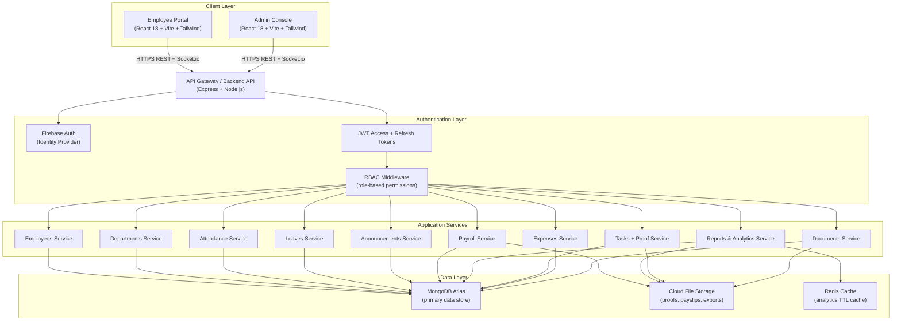
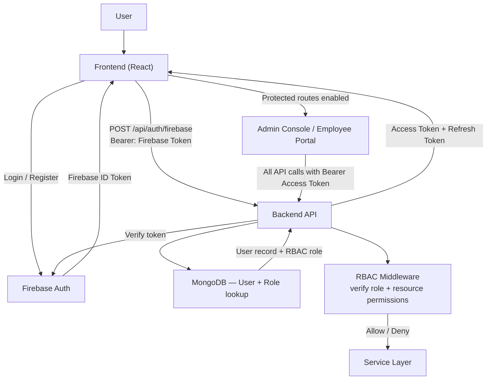
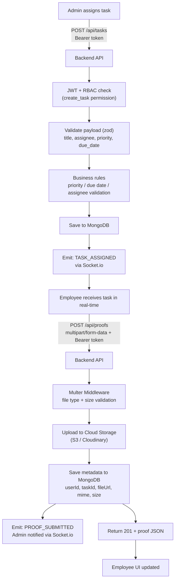
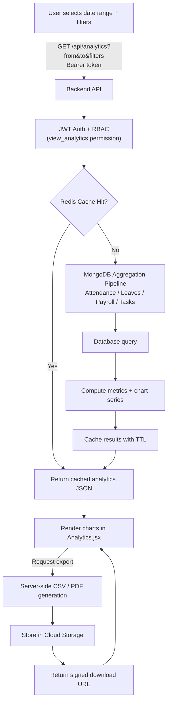
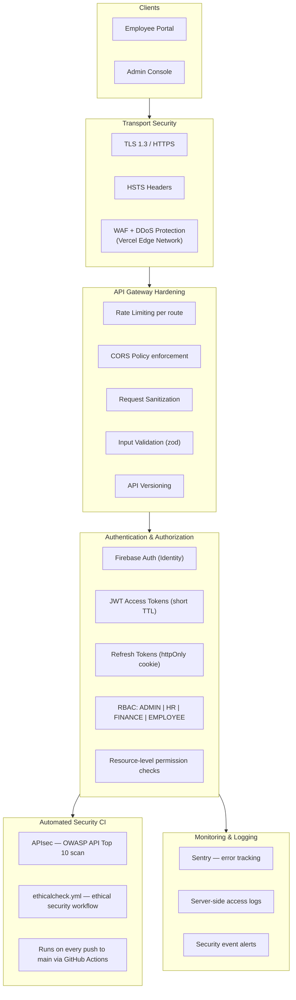

<div align="center">

# 🚀 ParadigmShift HRMS

**A production-grade, full-stack Human Resource Management System**  
built on the MERN stack with real-time sync, role-based access, and a live backend deployed on Vercel.

<br/>

[](https://mini-project-paradigm-shift-5y6i.vercel.app/)
[](https://reactjs.org/)
[](https://vercel.com/)
[](https://socket.io/)
[](https://firebase.google.com/)
[](https://tailwindcss.com/)
[](https://github.com/features/actions)
[](./LICENSE)

<br/>

[🌐 Live Demo](https://mini-project-paradigm-shift-5y6i.vercel.app/) &nbsp;·&nbsp; [🐛 Report Bug](https://github.com/MRINALPRAKASHFSD/MINI_PROJECT_PARADIGM_SHIFT/issues) &nbsp;·&nbsp; [💡 Request Feature](https://github.com/MRINALPRAKASHFSD/MINI_PROJECT_PARADIGM_SHIFT/issues)

</div>

---

## 📖 Table of Contents

- [Overview](#-overview)
- [Live Deployment](#-live-deployment)
- [Feature Breakdown](#-feature-breakdown)
  - [Admin Console](#-admin-console)
  - [Employee Portal](#-employee-portal)
  - [Workspace Module](#-workspace-module-employee-only)
- [Project Structure](#-project-structure)
- [System Architecture](#-system-architecture)
- [Authentication Flow](#-authentication-flow)
- [Task & Proof Submission Flow](#-task--proof-submission-flow)
- [Analytics & Reporting Flow](#-analytics--reporting-flow)
- [Security Architecture](#-security-architecture)
- [Tech Stack](#-tech-stack)
- [Local Development](#-local-development)
- [Environment Variables](#-environment-variables)
- [API Reference](#-api-reference)
- [Database Schema](#-database-schema)
- [Real-Time Synchronization](#-real-time-synchronization)
- [CI/CD & Security Pipeline](#-cicd--security-pipeline)
- [Deployment](#-deployment)
- [Team & Contributors](#-team--contributors)
- [Roadmap](#-roadmap)
- [Contributing](#-contributing)

---

## 🧠 Overview

**ParadigmShift** is a production-grade HRMS (Human Resource Management System) designed for modern organizations that need a unified, real-time platform to manage people, performance, and processes.

The system consists of **two independent React portals** — an Admin Console and an Employee Portal — both powered by a **shared live Express backend** deployed on Vercel with MongoDB Atlas as the single source of truth. There is no localStorage dependency in production.

What makes ParadigmShift stand out:

- 🎯 **Two complete portals** — purpose-built UX for admins and employees separately
- ⚡ **Real-time bidirectional sync** via Socket.io — zero manual page refreshes
- 🔐 **Multi-layer auth** — Firebase Authentication + JWT access/refresh tokens + RBAC middleware
- 🛡️ **Security-first CI** — APIsec automated API security scanning on every push to `main`
- 🎨 **Production-grade UI** — dark theme, Tailwind CSS, animated backgrounds, video backgrounds, toast notifications
- 🧰 **Rich Workspace module** — focus timers, peer chat, reminders, Spotify widget, time tracker, personal notes
- 🗂️ **Document & proof management** — multipart file upload, cloud storage, document verification workflow
- 📊 **Analytics & reporting** — personal and org-level analytics, CSV/PDF exports

---

## 🌐 Live Deployment

| Portal | URL | Description |
|---|---|---|
| 🧑‍💼 Employee Portal | [mini-project-paradigm-shift-5y6i.vercel.app](https://mini-project-paradigm-shift-5y6i.vercel.app/) | Employee self-service dashboard |
| 🛠️ Admin Console | [/admin](https://mini-project-paradigm-shift-5y6i.vercel.app/admin) | HR & management control plane |
| 🔌 Backend API | [/api](https://mini-project-paradigm-shift-5y6i.vercel.app/api) | Shared REST + Socket.io API |

> All three apps are served from a **single Vercel deployment** using unified monorepo routing configured in `vercel.json`.

---

## ✨ Feature Breakdown

### 🛠️ Admin Console

The Admin Console is the central control plane for HR managers, finance teams, and administrators.

#### 📋 Dashboard
- Real-time KPI overview — headcount, active leaves, payroll status, attendance rates
- Animated background and video background options for an immersive UI experience

#### 👥 Employee Management
- Full employee lifecycle — add, view, edit, deactivate
- `EmployeeList`, `EmployeeForm`, `EmployeeProfile` components
- Searchable, filterable employee directory with department and status filters

#### 🏢 Department Management
- Create and manage departments with budget tracking and performance indicators
- Assign department heads directly from the employee roster

#### 📅 Attendance Report
- Attendance dashboard with date-range filtering and status breakdown
- View per-employee attendance history — Present / Absent / Late / WFH
- Export attendance reports as CSV

#### 🌿 Leave Management
- Review all incoming leave requests across the organization
- Approve or reject with timestamps and full reviewer audit trail
- Leave history per employee with type and duration breakdown

#### 💰 Payroll Processing
- Create and process monthly payroll runs
- Per-employee payslip generation with basic, allowances, deductions, and net pay
- Payroll reports export for finance teams

#### 💸 Expense Approvals
- Review and approve or reject employee expense claims
- Full expense history per employee with proof attachments

#### 📢 Announcements
- Create announcements with configurable priority levels (Low / Medium / High / Urgent)
- View count tracking per announcement
- Company-wide or department-targeted broadcasts

#### ✅ Task Assignment
- Assign tasks to employees with priority, due date, and description
- Real-time task status updates pushed via Socket.io
- Review submitted work proofs per task

#### 📄 Document Verification
- Review and verify employee-submitted documents and work proofs
- Approve or reject with reviewer comments and timestamp logging

#### ⚙️ Company Settings
- Configure company profile, working hours, leave policies
- Global admin configuration via `CompanySettings` component

---

### 👨‍💻 Employee Portal

The Employee Portal is the self-service hub for every employee in the organization.

#### 🏠 Landing Page & Auth
- Custom animated landing page (`LandingPage.jsx`) with background pattern
- Register and Login flows backed by Firebase Authentication
- `ProfileSetup` onboarding flow for first-time users
- `CompanySetupModal` for initial company configuration

#### 📊 Dashboard
- Personalized dashboard with upcoming tasks, meetings, announcements
- Priority tasks widget and recent docs widget at a glance
- Global dark mode toggle

#### 📅 Calendar
- View personal schedule, meetings, task deadlines in one place
- Integrated with leave requests and meeting data

#### 🌿 Leave Management
- Apply for leave with type, date range, and reason
- Real-time approval status — Pending / Approved / Rejected
- Full leave history

#### ⏱️ Time Tracker
- Log hours per task or project
- Daily and weekly time summaries

#### 📈 Analytics
- Personal productivity analytics dashboard (`Analytics.jsx`)
- Attendance trends, task completion rates, leave summaries

#### 📋 Tasks
- View all assigned tasks with priority and deadline
- Update task status in real-time via Socket.io

#### 📁 Documents
- View and manage personal documents
- `RecentDocsWidget` for quick access to recently used files

#### 💳 Payslips
- Download monthly payslips (PDF/CSV)
- Full payslip history with itemised breakdown

#### 💸 Expenses
- Submit expense claims with supporting receipts
- Track approval status with real-time updates

#### 🤝 Meetings
- View scheduled meetings, agendas, and participants
- Calendar-integrated meeting management (`Meetings.jsx`)

#### 👥 Teams
- View team structure and fellow team members
- Department-level team overview (`Teams.jsx`)

#### 🔔 Notifications
- Real-time notification centre (`Notifications.jsx`)
- Toast notification system (`Toast.jsx`) for instant feedback

#### 📎 Submit Proof
- Upload work proof files for assigned tasks
- Multipart file upload with type/size validation and cloud storage

#### 👤 Profile & Settings
- Edit personal info, contact details, and profile photo
- App preferences and settings management

#### 📊 Reports
- Personal reports — attendance summary, leave history, payslip records

---

### 🧰 Workspace Module (Employee Only)

A dedicated productivity workspace embedded within the Employee Portal — a unique feature of ParadigmShift that goes beyond standard HRMS functionality.

| Widget | Description |
|---|---|
| ⏱️ **FocusTimer** | Pomodoro-style focus timer for deep work sessions |
| 💬 **PeerChat** | Real-time peer-to-peer chat between employees |
| 📝 **PersonalNotes** | Private sticky notes and quick note-taking |
| 🎯 **PriorityTasksWidget** | Instant view of highest-priority assigned tasks |
| 📂 **RecentDocsWidget** | Quick access to recently opened documents |
| ⏰ **ReminderEngine** | Smart reminder system with in-app notifications |
| 🎵 **SpotifyWidget** | Embedded Spotify player for focus music during work |

---

## 🏗️ Project Structure

```
ParadigmShift/
│
├── .github/
│   └── workflows/
│       ├── apisec-inc/             # APIsec automated API security scanning
│       └── ethicalcheck.yml        # Ethical security check on every push
│
├── .sixth/skills/                  # Internal skill configuration
│
├── backend/                        # Express REST API + Socket.io server
│   └── src/
│       ├── config/                 # env.ts, cors.ts
│       ├── middleware/             # auth.ts, roles.ts, validate.ts
│       ├── modules/
│       │   ├── auth/
│       │   ├── employees/
│       │   ├── departments/
│       │   ├── leaves/
│       │   ├── attendance/
│       │   ├── tasks/
│       │   ├── proofs/
│       │   ├── expenses/
│       │   ├── payroll/
│       │   ├── announcements/
│       │   └── reports/
│       ├── db/                     # MongoDB connection, Mongoose models
│       └── utils/                  # csv.ts, pdf.ts, logger.ts
│
├── frontend-admin/                 # Admin Console — React 18 + Vite + Tailwind
│   └── src/
│       ├── components/
│       │   ├── AnimatedBackground.jsx
│       │   ├── Announcements.jsx
│       │   ├── AttendanceReport.jsx
│       │   ├── CompanySettings.jsx
│       │   ├── Dashboard.jsx
│       │   ├── Departments.jsx
│       │   ├── DocumentVerification.jsx
│       │   ├── EmployeeForm.jsx
│       │   ├── EmployeeList.jsx
│       │   ├── EmployeeProfile.jsx
│       │   ├── Employees.jsx
│       │   ├── ExpenseApprovals.jsx
│       │   ├── Layout.jsx
│       │   ├── LeaveManagement.jsx
│       │   ├── Login.jsx
│       │   ├── Navbar.jsx
│       │   ├── Payroll.jsx
│       │   ├── Reports.jsx
│       │   ├── Sidebar.jsx
│       │   ├── TaskAssignment.jsx
│       │   └── VideoBackground.jsx
│       ├── config/
│       ├── context/
│       ├── services/
│       │   ├── api.js              # Axios HTTP client with interceptors
│       │   └── socket.js           # Socket.io client connection
│       └── store/
│
├── frontend-employee/              # Employee Portal — React 18 + Vite + Tailwind
│   └── src/
│       ├── components/
│       │   ├── layout/
│       │   ├── workspace/
│       │   │   ├── FocusTimer.jsx
│       │   │   ├── PeerChat.jsx
│       │   │   ├── PersonalNotes.jsx
│       │   │   ├── PriorityTasksWidget.jsx
│       │   │   ├── RecentDocsWidget.jsx
│       │   │   ├── ReminderEngine.jsx
│       │   │   └── SpotifyWidget.jsx
│       │   ├── BackgroundPattern.jsx
│       │   ├── CompanySetupModal.jsx
│       │   ├── DarkModeToggle.jsx
│       │   ├── Layout.jsx
│       │   ├── LoadingSpinner.jsx
│       │   ├── Navbar.jsx
│       │   └── Toast.jsx
│       ├── pages/
│       │   ├── Analytics.jsx
│       │   ├── Calendar.jsx
│       │   ├── Dashboard.jsx
│       │   ├── Documents.jsx
│       │   ├── Expenses.jsx
│       │   ├── LandingPage.jsx
│       │   ├── LeaveManagement.jsx
│       │   ├── Login.jsx
│       │   ├── Meetings.jsx
│       │   ├── Notifications.jsx
│       │   ├── Payslips.jsx
│       │   ├── Profile.jsx
│       │   ├── ProfileSetup.jsx
│       │   ├── Register.jsx
│       │   ├── Reports.jsx
│       │   ├── Settings.jsx
│       │   ├── SubmitProof.jsx
│       │   ├── Tasks.jsx
│       │   ├── Teams.jsx
│       │   └── TimeTracker.jsx
│       ├── config/
│       ├── hooks/
│       ├── routes/
│       ├── services/
│       └── store/
│
├── render.yaml                     # Render.com alternate deployment config
├── vercel.json                     # Vercel unified monorepo routing
├── SECURITY.md                     # Security policy + responsible disclosure
├── LICENSE                         # MIT License
└── README.md
```

---

## 🏛️ System Architecture



---

## 🔐 Authentication Flow



---

## 📋 Task & Proof Submission Flow



---

## 📊 Analytics & Reporting Flow



---

## 🛡️ Security Architecture



> **APIsec Integration:** Every push to `main` triggers an automated API security scan via `.github/workflows/apisec-inc`, checking for OWASP vulnerabilities, broken object-level authorization (BOLA), injection risks, and authentication weaknesses.

---

## 🛠️ Tech Stack

| Category | Technology | Purpose |
|---|---|---|
| **Frontend** | React 18 + Vite | Both portals — fast HMR, optimized production builds |
| **Styling** | Tailwind CSS | Utility-first, dark-mode-ready, responsive styling |
| **Backend** | Node.js + Express | REST API server + Socket.io real-time layer |
| **Database** | MongoDB Atlas + Mongoose | Primary production data store |
| **Auth** | Firebase Authentication | Identity provider — email/password + OAuth |
| **Session** | JWT + Refresh Tokens | Stateless API auth with RBAC |
| **Realtime** | Socket.io | Bidirectional event-driven synchronization |
| **File Storage** | Cloud Storage (S3/Cloudinary) | Proofs, payslips, exports, documents |
| **Reports** | Server-side CSV + PDF | Payroll, attendance, department data exports |
| **Deployment** | Vercel (primary) | Unified monorepo hosting — all three apps |
| **Alt Deploy** | Render (`render.yaml`) | Backend fallback for persistent Socket.io |
| **Security CI** | APIsec + GitHub Actions | Automated API vulnerability scanning |
| **API Client** | Axios (`api.js`) | HTTP client with request/response interceptors |
| **Socket Client** | Socket.io client (`socket.js`) | Real-time event subscriptions |
| **State** | React Context + Store | App-wide state management |
| **Routing** | React Router v6 | SPA routing with protected + role-gated routes |
| **Notifications** | Toast.jsx + Notifications page | In-app + real-time alert system |

---

## 💻 Local Development

### Prerequisites

- **Node.js** v18 or higher
- **npm** v9 or higher
- **MongoDB Atlas** URI (or a local MongoDB instance)
- **Firebase** project with Authentication enabled

### 1. Clone the repository

```bash
git clone https://github.com/MRINALPRAKASHFSD/MINI_PROJECT_PARADIGM_SHIFT.git
cd MINI_PROJECT_PARADIGM_SHIFT
```

### 2. Start the Backend API

```bash
cd backend
npm install
npm run dev
# API server  → http://localhost:5050/api
# Socket.io   → http://localhost:5050
```

### 3. Start the Admin Console

```bash
cd ../frontend-admin
npm install
npm run dev
# Admin portal → http://localhost:5173/admin
```

### 4. Start the Employee Portal

```bash
cd ../frontend-employee
npm install
npm run dev
# Employee portal → http://localhost:5174/
```

> **Tip:** Run all three concurrently from the repo root using the `concurrently` package. Ensure your backend `.env` `CORS_ORIGINS` includes both Vite ports (`5173` and `5174`).

### 5. Verify your setup

```bash
curl http://localhost:5050/api/health
# Expected: { "status": "ok", "db": "connected" }
```

---


## 📡 API Reference

### Authentication

| Method | Endpoint | Auth | Description |
|---|---|---|---|
| `POST` | `/api/auth/login` | Public | Email/password login |
| `POST` | `/api/auth/firebase` | Public | Firebase ID token exchange |
| `POST` | `/api/auth/register` | Public | New user registration |
| `POST` | `/api/auth/refresh` | Public | Refresh access token |
| `POST` | `/api/auth/logout` | Bearer | Invalidate current session |

### Employees

| Method | Endpoint | Access | Description |
|---|---|---|---|
| `GET` | `/api/employees` | Admin, HR | List all employees |
| `POST` | `/api/employees` | Admin, HR | Create new employee |
| `GET` | `/api/employees/:id` | Admin, HR, Self | Get employee profile |
| `PATCH` | `/api/employees/:id` | Admin, HR | Update employee record |
| `DELETE` | `/api/employees/:id` | Admin | Deactivate employee |

### Departments

| Method | Endpoint | Access | Description |
|---|---|---|---|
| `GET` | `/api/departments` | All authenticated | List departments |
| `POST` | `/api/departments` | Admin | Create department |
| `PATCH` | `/api/departments/:id` | Admin | Update department |
| `DELETE` | `/api/departments/:id` | Admin | Delete department |

### Attendance

| Method | Endpoint | Access | Description |
|---|---|---|---|
| `GET` | `/api/attendance` | Admin, HR | All attendance records |
| `GET` | `/api/attendance/me` | Employee | Own attendance history |
| `POST` | `/api/attendance/checkin` | Employee | Record check-in |
| `POST` | `/api/attendance/checkout` | Employee | Record check-out |

### Leave Management

| Method | Endpoint | Access | Description |
|---|---|---|---|
| `GET` | `/api/leaves` | Admin, HR | All leave requests |
| `GET` | `/api/leaves/me` | Employee | Own leave requests |
| `POST` | `/api/leaves` | Employee | Apply for leave |
| `PATCH` | `/api/leaves/:id/approve` | HR | Approve leave request |
| `PATCH` | `/api/leaves/:id/reject` | HR | Reject leave request |

### Tasks

| Method | Endpoint | Access | Description |
|---|---|---|---|
| `GET` | `/api/tasks` | Admin, HR | All tasks |
| `GET` | `/api/tasks/me` | Employee | Own assigned tasks |
| `POST` | `/api/tasks` | Admin, HR | Create and assign task |
| `PATCH` | `/api/tasks/:id` | Admin, HR, Assignee | Update task status |
| `DELETE` | `/api/tasks/:id` | Admin | Delete task |

### Proof Submission

| Method | Endpoint | Access | Description |
|---|---|---|---|
| `POST` | `/api/proofs` | Employee | Upload work proof (multipart/form-data) |
| `GET` | `/api/proofs` | Admin, HR | All submitted proofs |
| `PATCH` | `/api/proofs/:id/verify` | Admin, HR | Verify or reject proof |

### Expenses

| Method | Endpoint | Access | Description |
|---|---|---|---|
| `GET` | `/api/expenses` | Admin, Finance | All expense claims |
| `POST` | `/api/expenses` | Employee | Submit expense claim |
| `PATCH` | `/api/expenses/:id/approve` | Admin, Finance | Approve expense |
| `PATCH` | `/api/expenses/:id/reject` | Admin, Finance | Reject expense |

### Payroll

| Method | Endpoint | Access | Description |
|---|---|---|---|
| `GET` | `/api/payroll/runs` | Finance, Admin | List all payroll runs |
| `POST` | `/api/payroll/runs` | Finance | Create payroll run for a month |
| `POST` | `/api/payroll/runs/:id/process` | Finance | Process and generate payslips |
| `GET` | `/api/payslips/me` | Employee | View own payslips |
| `GET` | `/api/payslips/:id/download` | Employee, Admin | Download payslip (PDF/CSV) |

### Announcements

| Method | Endpoint | Access | Description |
|---|---|---|---|
| `GET` | `/api/announcements` | All authenticated | List all announcements |
| `POST` | `/api/announcements` | Admin, HR | Create announcement |
| `PATCH` | `/api/announcements/:id` | Admin, HR | Update announcement |
| `DELETE` | `/api/announcements/:id` | Admin | Delete announcement |
| `POST` | `/api/announcements/:id/view` | All | Increment view count |

### Reports & Analytics

| Method | Endpoint | Access | Description |
|---|---|---|---|
| `GET` | `/api/analytics?from&to&filters` | Admin, HR, Finance | Aggregated analytics data |
| `GET` | `/api/reports/payroll?month=YYYY-MM&format=csv` | Finance, Admin | Payroll report export |
| `GET` | `/api/reports/attendance?format=csv` | Admin, HR | Attendance report export |
| `GET` | `/api/reports/departments?format=csv` | Admin | Department performance report |
| `GET` | `/api/reports/employees?format=csv` | Admin, HR | Employee directory export |

---

## 🗄️ Database Schema

### Collections Overview

```
users              → authentication records + RBAC role mapping
employees          → core employee entity (linked to users)
departments        → organizational units with budgets
announcements      → company-wide or department communications
leaves             → leave requests + approval/rejection workflow
attendance         → daily check-in/check-out records
tasks              → work items assigned to employees
proofs             → task work proof file submissions
expenses           → employee expense claims + receipts
payroll_runs       → monthly payroll batch processing records
payslips           → per-employee payslip per payroll run
documents          → employee document management store
notifications      → in-app notification records
```

### Key Schema Definitions

```js
// users
{
  _id, email, password_hash,
  role: "ADMIN" | "HR" | "FINANCE" | "EMPLOYEE",
  employee_id,        // ref → employees
  firebase_uid,
  created_at, updated_at
}

// employees
{
  _id, employee_code,  // EMP001, EMP002...
  name, email, phone,
  department_id,       // ref → departments
  designation, joining_date,
  status: "ACTIVE" | "INACTIVE",
  profile_photo_url
}

// tasks
{
  _id, title, description,
  assigned_to,         // ref → employees
  assigned_by,         // ref → users
  priority: "LOW" | "MEDIUM" | "HIGH" | "URGENT",
  status: "PENDING" | "IN_PROGRESS" | "SUBMITTED" | "APPROVED" | "REJECTED",
  due_date, created_at, updated_at
}

// proofs
{
  _id, task_id, employee_id,
  file_url, file_name, mime_type, file_size,
  comment,
  status: "PENDING" | "VERIFIED" | "REJECTED",
  reviewed_by, reviewed_at, submitted_at
}

// expenses
{
  _id, employee_id,
  title, amount, category,
  receipt_url, description,
  status: "PENDING" | "APPROVED" | "REJECTED",
  reviewed_by, reviewed_at, submitted_at
}

// payslips
{
  _id, payroll_run_id, employee_id,
  basic, allowances, deductions, net,
  payment_date,
  status: "PENDING" | "PROCESSED" | "PAID"
}
```

### RBAC Permission Matrix

| Feature | ADMIN | HR | FINANCE | EMPLOYEE |
|---|:---:|:---:|:---:|:---:|
| Manage all employees | ✅ | ✅ | ❌ | ❌ |
| View own profile | ✅ | ✅ | ✅ | ✅ |
| Approve / reject leaves | ✅ | ✅ | ❌ | ❌ |
| Apply for leave | ✅ | ✅ | ✅ | ✅ |
| Assign tasks | ✅ | ✅ | ❌ | ❌ |
| Submit work proof | ❌ | ❌ | ❌ | ✅ |
| Verify documents | ✅ | ✅ | ❌ | ❌ |
| Process payroll | ✅ | ❌ | ✅ | ❌ |
| View own payslips | ✅ | ✅ | ✅ | ✅ |
| Approve expenses | ✅ | ❌ | ✅ | ❌ |
| Submit expenses | ✅ | ✅ | ✅ | ✅ |
| Export reports | ✅ | ✅ | ✅ | ❌ |
| Company settings | ✅ | ❌ | ❌ | ❌ |
| View analytics | ✅ | ✅ | ✅ | ❌ (own only) |

---

## ⚡ Real-Time Synchronization

ParadigmShift uses **Socket.io** for bidirectional, room-scoped real-time updates across both portals. No manual page refresh is ever needed.

### Key Socket Events

| Event | Direction | Triggered By |
|---|---|---|
| `TASK_ASSIGNED` | Admin → Employee | Admin creates and assigns a task |
| `TASK_UPDATED` | Employee → Admin | Employee updates task status |
| `PROOF_SUBMITTED` | Employee → Admin | Employee uploads work proof |
| `PROOF_VERIFIED` | Admin → Employee | Admin verifies or rejects a proof |
| `LEAVE_APPLIED` | Employee → Admin | Employee submits a leave request |
| `LEAVE_DECISION` | Admin → Employee | Leave approved or rejected |
| `EXPENSE_SUBMITTED` | Employee → Admin | Employee submits expense claim |
| `EXPENSE_DECISION` | Admin → Employee | Expense approved or rejected |
| `ANNOUNCEMENT_POSTED` | Admin → All | New company announcement published |
| `NOTIFICATION` | Server → Client | General in-app notification push |
| `PEER_CHAT_MESSAGE` | Employee ↔ Employee | PeerChat workspace messages |

> All events are scoped by user ID or department room to prevent cross-user data leakage.

---

## 🔒 CI/CD & Security Pipeline

ParadigmShift ships with a production-grade automated security pipeline built directly into GitHub Actions.

### Workflows

```
.github/workflows/
├── apisec-inc/           # APIsec automated API security scan
└── ethicalcheck.yml      # Ethical security check workflow
```

### What APIsec scans on every push to `main`

- OWASP API Security Top 10 vulnerabilities
- Broken Object Level Authorization (BOLA / IDOR)
- Broken Authentication and token handling
- Excessive Data Exposure in API responses
- SQL/NoSQL injection vulnerabilities
- Improper rate limiting detection
- Security misconfiguration checks

### Security Policy

A `SECURITY.md` file is included in the repository root with responsible disclosure guidelines. See [SECURITY.md](./SECURITY.md) to report a vulnerability privately.

---

## 🚀 Deployment

### Vercel — Primary (Live)

All three apps are deployed as a **unified monorepo on Vercel** under a single domain using custom routing in `vercel.json`.

```
https://mini-project-paradigm-shift-5y6i.vercel.app/        → Employee Portal
https://mini-project-paradigm-shift-5y6i.vercel.app/admin   → Admin Console
https://mini-project-paradigm-shift-5y6i.vercel.app/api     → Backend API
```

**Auto-deploy on push:**
1. Push to `main` → GitHub Actions APIsec security scan triggers
2. On scan pass → Vercel auto-builds and deploys all three apps
3. Environment variables configured per-app in the Vercel dashboard
4. All three apps live under one domain, zero downtime deployments

### Render — Alternate Backend (`render.yaml`)

A `render.yaml` config is included for deploying the backend as a **persistent web service on Render**. This is recommended if you need long-running Socket.io connections that Vercel's serverless functions cannot support for extended durations.

---

## 👥 Team & Contributors

| Handle | Role |
|---|---|
| 👑 [**MRINALPRAKASHFSD**](https://github.com/MRINALPRAKASHFSD) | Maintainer · Lead Developer · Backend Architecture · DevOps · CI/CD |
| 🧑‍💻 AdiT0015 | Frontend Developer · Admin Console |
| 🧑‍💻 IshaanParashar2025 | Backend Integration · Database Manager |
| 🧑‍💻 Mahin | UI/UX Design · Software Testing |
| 🧑‍💻 Prarock83 | Lead Backend Developer · Employee & Admin Portal |
| 👩‍💻 Diyagoel08 | Documentation · QA Testing |

---

## 🗺️ Roadmap

### ✅ Phase 1 — Prototype
- [x] All CRUD modules with working UI
- [x] CSV export and in-browser downloads
- [x] Dark theme, animated backgrounds, Tailwind styling
- [x] Video background component

### ✅ Phase 2 — Backend Integration
- [x] Live Express backend deployed on Vercel
- [x] MongoDB Atlas as single source of truth (no localStorage in production)
- [x] Replaced all localStorage with real API calls via `api.js`
- [x] Firebase Auth + JWT access/refresh tokens + RBAC
- [x] Socket.io real-time bidirectional sync
- [x] Employee Portal fully connected to backend
- [x] APIsec + ethicalcheck.yml automated security CI
- [x] Expense Approvals module (admin + employee)
- [x] Document Verification module
- [x] Task Assignment + Proof Submission full workflow
- [x] Workspace module — FocusTimer, PeerChat, PersonalNotes, SpotifyWidget, ReminderEngine, PriorityTasksWidget, RecentDocsWidget
- [x] Analytics page + Time Tracker
- [x] Calendar and Meetings pages
- [x] Teams page
- [x] Toast notification system + LoadingSpinner
- [x] Dark mode toggle
- [x] ProfileSetup + CompanySetupModal onboarding
- [x] Custom hooks and routes folders
- [x] Render alternate deployment config

### 🔄 Phase 3 — Enterprise Features
- [ ] Server-side PDF payslip generation
- [ ] Comprehensive audit log for all admin actions
- [ ] Global command palette (`Cmd+K` search)
- [ ] Advanced analytics charts with recharts / d3
- [ ] Web push notifications (FCM integration)
- [ ] Mobile-responsive PWA with offline support
- [ ] Undo / soft-delete for critical destructive actions
- [ ] Multi-company / multi-tenant architecture
- [ ] Unit + integration test coverage (Jest + Vitest)
- [ ] E2E testing with Playwright

---

## 🤝 Contributing

Contributions are welcome from all collaborators.

1. **Get access** — accept your GitHub collaborator invite
2. **Pull latest main:**
   ```bash
   git pull origin main
   ```
3. **Create a feature branch:**
   ```bash
   git checkout -b feat/<feature-name>
   # examples: feat/pdf-payslips, feat/audit-logs, fix/leave-approval-bug
   ```
4. **Commit with a structured message:**
   ```bash
   git commit -m "✨ [panel] <feature>: short summary"
   # panels: admin | employee | backend | workspace | ci | docs
   ```
5. **Push and open a Pull Request** with a clear title and description of your changes

**Guidelines:**
- Keep PRs focused — one feature or one fix per PR
- Write descriptive PR descriptions explaining what changed and why
- Open an issue for any blockers, design questions, or breaking changes before implementing

---

## 📬 Contact & Support

- 🐛 **Bug reports / feature requests:** [Open an issue](https://github.com/MRINALPRAKASHFSD/MINI_PROJECT_PARADIGM_SHIFT/issues)
- 💬 **Direct contact:** [@MRINALPRAKASHFSD](https://github.com/MRINALPRAKASHFSD)
- 🔐 **Security vulnerabilities:** Follow the responsible disclosure process in [SECURITY.md](./SECURITY.md)

---

<div align="center">

**Built with ❤️ by the ParadigmShift Team**

MERN · Socket.io · Firebase · Tailwind CSS · Vercel · 2025–2026

</div>
